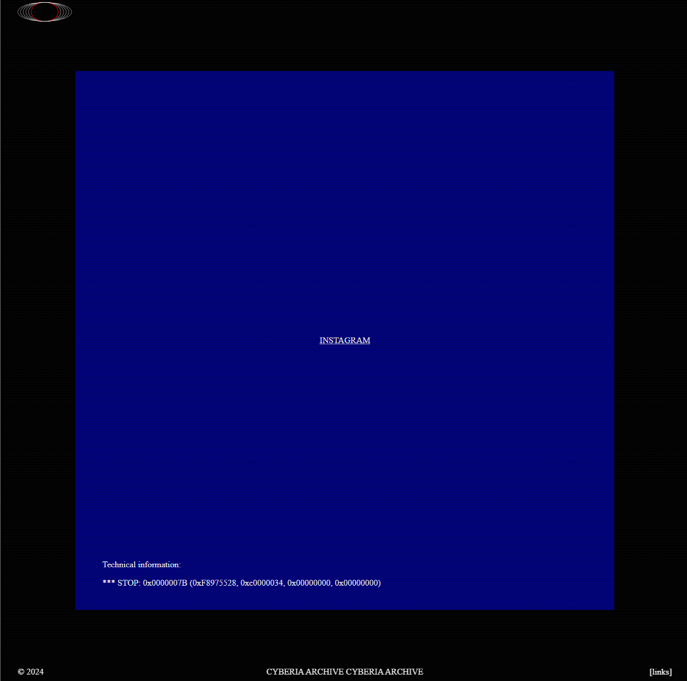

<!--
# webtests
testing an extremely minimal website only using html and vanilla css for the webring thats supposed to be my main webpage for everything.

# What is the Webring?
The [webring](https://wiki.xxiivv.com/site/webring.html) is an attempt to inspire artists & developers to create and maintain their own personal websites, and share traffic among each other. The webring's aim is to share rich hand-crafted websites such as diaries, wikis & portfolios.

[-> to the main webring repository](https://github.com/XXIIVV/webring)

# Help
The ring is managed by [@neauoire](https://merveilles.town/@neauoire), but any member of the network is also welcome to join the repository as a collaborator to help manage new links and Pull Requests. Read more about the webring [here](https://wiki.xxiivv.com/site/webring.html).

-->
# current status

using plain css and javascript
at https://folders64.github.io/

